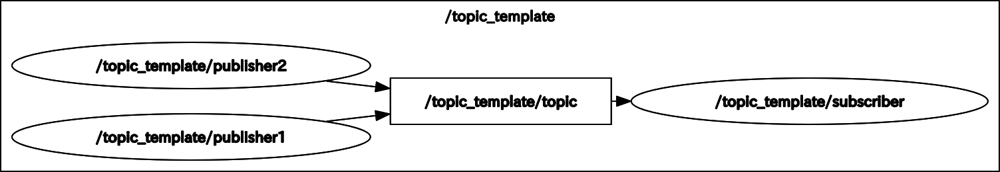
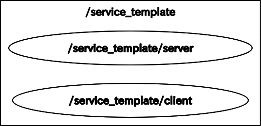

# ROS2 Template Programs(開発中)
ROS2のトピック通信、サービス通信、アクションのテンプレートプログラム

# Packages
## ros2_template_programs
- ROS2のトピック通信、サービス通信、アクションのテンプレートプログラム
- Launchファイル

## ros2_custom_msg
- カスタムメッセージやサービス  
※ 同じCMakeプロジェクトで`rosidl_generate_interfaces`と `ament_python_install_package`を呼び出すとうまくいきません。  
※ メッセージの生成は別のパッケージに分離するのがベストプラクティスです。

# Topic
std_msgs/String型のmessageをtopic通信

<div align="center">
    
</div>

## C++
```bash
$ ros2 launch ros2_template_programs topic_template.xml
```
- [`ros2_template_programs/launch/topic_template.launch`](ros2_template_programs/launch/topic_template.launch)
- [`ros2_template_programs/include/ros2_template_programs/topic_publisher_template.hpp`](ros2_template_programs/include/ros2_template_programs/topic_publisher_template.hpp)
- [`ros2_template_programs/src/topic_publisher_template.cpp`](ros2_template_programs/src/topic_publisher_template.cpp)
- [`ros2_template_programs/include/ros2_template_programs/topic_subscriber_template.hpp`](ros2_template_programs/include/ros2_template_programs/topic_subscriber_template.hpp)
- [`ros2_template_programs/src/topic_subscriber_template.cpp`](ros2_template_programs/src/topic_subscriber_template.cpp)

## Python
```py
$ ros2 launch ros2_template_programs topic_template_py.xml
```
- [`ros2_template_programs/launch/topic_template_py.xml`](ros2_template_programs/launch/topic_template_py.xml)
- [`ros2_template_programs/scripts/topic_publisher_template.py`](ros2_template_programs/scripts/topic_publisher_template.py)
- [`ros2_template_programs/scripts/topic_subscriber_template.py`](ros2_template_programs/scripts/topic_subscriber_template.py)

# Service
計算式を送り，計算結果を返すサービス通信
- [`ros2_custom_msg/msg/Expression.msg`](ros2_custom_msg/msg/Expression.msg)
- [`ros2_custom_msg/srv/Calculation.srv`](ros2_custom_msg/srv/Calculation.srv)

<div align="center">
    
</div> 

# C++
```py
$ ros2 launch ros2_template_programs service_template.xml
```
- [`ros2_template_programs/launch/service_template.xml`](ros2_template_programs/launch/service_template.xml)
- [`ros2_template_programs/include/ros2_template_programs/service_client_template.hpp`](ros2_template_programs/include/ros2_template_programs/service_client_template.hpp)
- [`ros2_template_programs/scripts/service_client_template.cpp`](ros2_template_programs/scripts/service_client_template.cpp)
- [`ros2_template_programs/include/ros2_template_programs/service_server_template.hpp`](ros2_template_programs/include/ros2_template_programs/service_server_template.hpp)
- [`ros2_template_programs/scripts/service_server_template.cpp`](ros2_template_programs/scripts/service_server_template.cpp)

### Call a service from the callback function
- コールバック関数からサービスを呼び出そうとすると，`rclcpp::spin_until_future_complete(this->get_node_base_interface()， future)`でスタックします
- これは，サービスの処理よりも早くコールバック関数が呼ばれる可能性があるからです
- そこで新たに`callbackRresponse関数`を用意して，そこで結果を読み取ることで解決します
```py
$ ros2 launch ros2_template_programs service_client_from_callback_template.xml
```
- [`ros2_template_programs/launch/service_client_from_callback_template.xml`](ros2_template_programs/launch/service_client_from_callback_template.xml)
- [`ros2_template_programs/include/ros2_template_programs/service_client_from_callback_template.hpp`](ros2_template_programs/include/ros2_template_programs/service_client_from_callback_template.hpp)
- [`ros2_template_programs/scripts/service_client_from_callback_template.cpp`](ros2_template_programs/scripts/service_client_from_callback_template.cpp)


## Python
```py
$ ros2 launch ros2_template_programs service_template_py.xml
```
- [`ros2_template_programs/launch/service_template_py.xml`](ros2_template_programs/launch/service_template_py.xml)
- [`ros2_template_programs/scripts/service_client_template.py`](ros2_template_programs/scripts/service_client_template.py)
- [`ros2_template_programs/scripts/service_server_template.py`](ros2_template_programs/scripts/service_server_template.py)

### Call a service from the callback function
- コールバック関数からサービスを呼び出そうとすると，`rclpy.spin_until_future_complete(self， future)`でスタックします
- これは，サービスの処理よりも早くコールバック関数が呼ばれる可能性があるからです
- そこで新たに`spin関数`を用意して，そこで結果を読み取ることで解決します
```py
$ ros2 launch ros2_template_programs service_client_from_callback_template_py.xml
```
- [`ros2_template_programs/launch/service_client_from_callback_template_py.xml`](ros2_template_programs/launch/service_client_from_callback_template_py.xml)
- [`ros2_template_programs/scripts/service_client_from_callback_template.py`](ros2_template_programs/scripts/service_client_from_callback_template.py)

# 補足
## パッケージの作成方法
```py
# ament_cmake
$ ros2 pkg create package_name --build-type ament_cmake --dependencies rclcpp rclpy std_msgs
# ament_python
$ ros2 pkg create package_name --build-type ament_python --dependencies rclcpp rclpy std_msgs
```

## ビルド
```py
# 全パッケージのビルド
$ colcon build
# 指定パッケージのビルド
$ colcon build　--symlink-install --packages-up-to package_name
```
- `--symlink-install`
    - 可能な限りリンクを使用して2重にファイルをつくらない？
- `--packages-up-to [package1 package2 ...]`
    - 指定されたパッケージとそれに依存関係のあるパッケージのみをビルドする．
    - 複数指定する場合にはスペース区切りとする．

# Reference
- [Writing a simple publisher and subscriber (C++)](https://docs.ros.org/en/humble/Tutorials/Beginner-Client-Libraries/Writing-A-Simple-Cpp-Publisher-And-Subscriber.html)
- [Writing a simple publisher and subscriber (Python)](https://docs.ros.org/en/humble/Tutorials/Beginner-Client-Libraries/Writing-A-Simple-Py-Publisher-And-Subscriber.html)
- [Writing a simple service and client (C++)](https://docs.ros.org/en/humble/Tutorials/Beginner-Client-Libraries/Writing-A-Simple-Cpp-Service-And-Client.html)
- [Writing a simple service and client (Python)](https://docs.ros.org/en/humble/Tutorials/Beginner-Client-Libraries/Writing-A-Simple-Py-Service-And-Client.html)
- [Using parameters in a class (Python)](https://docs.ros.org/en/humble/Tutorials/Beginner-Client-Libraries/Using-Parameters-In-A-Class-Python.html)
- [Creating a launch file](https://docs.ros.org/en/humble/Tutorials/Intermediate/Launch/Creating-Launch-Files.html)
- [Creating custom msg and srv files](https://docs.ros.org/en/humble/Tutorials/Beginner-Client-Libraries/Custom-ROS2-Interfaces.html)
- [rclpy Params Tutorial – Get and Set ROS2 Params with Python](https://roboticsbackend.com/rclpy-params-tutorial-get-set-ros2-params-with-python/)
- [ROS2 : How to call a service from the callback function of a subscriber ?](https://answers.ros.org/question/302037/ros2-how-to-call-a-service-from-the-callback-function-of-a-subscriber/)
- [ROS2 Service Client in C++ with Classes with Node Inheritance](https://get-help.robotigniteacademy.com/t/ros2-service-client-in-c-with-classes-with-node-inheritance/19647)
- [[ROS2 foxy] c++とpython共存パッケージのテンプレート](https://qiita.com/ousagi_sama/items/e1eb921f1b2e6b890133)
- [Create a ROS2 package for Both Python and Cpp Nodes](https://roboticsbackend.com/ros2-package-for-both-python-and-cpp-nodes/)
- [ament_cmake_python user documentation](https://docs.ros.org/en/foxy/How-To-Guides/Ament-CMake-Python-Documentation.html)
- [ROS2プロジェクトの作成](https://qiita.com/NeK/items/1d13d41bd0565e8da854)
- [ROS2の最小構成service/client:初級 -class style-](https://qiita.com/NeK/items/9d15487d4853638394a3)
- [メタビルドシステムament](https://www.youtalk.jp/2017/05/29/ament.html)
- [ROS 2 EloquentのXML記法を使ったLaunchシステム](https://www.youtalk.jp/2019/12/06/launch-xml.html)
- [ROS2でyamlファイルからパラメータを設定する。](https://qiita.com/shigeharu_shibahata/items/82e8f562d2e6395ba115)
- [ROS2プログラミング入門 #8 ノードをクラスにする](https://zenn.dev/uchidaryo/articles/ros2-programming-8)
- [ROS2でコードチェック！](https://hans-robo.hatenablog.com/entry/2020/04/08/084654)
